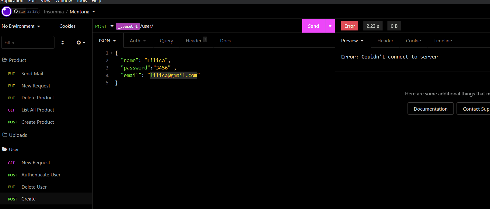

### 💻 Projeto

BackEnd Para cadastro de usuário e compra de produtos

<h1 align = "center">
    
</h1>

### ⚙ Pré-requisitos

Antes de começar, você vai precisar ter instalado em sua máquina as seguintes ferramentas:
[Git](https://git-scm.com), [Node.js](https://nodejs.org/en/) e/ou [Yarn](https://https://yarnpkg.com/)
Além disto é bom ter um editor para trabalhar com o código como [VSCode](https://code.visualstudio.com/)

### Vamos começar!! ✍

### 📙 Rodando o Backend

```bash
# Clone este repositório
$ git clone git@github.com:SilvioSG/Compra_de_Produtos.git

# Inicializar o docker
$ docker-compose up

# Execute as migrations
$ yarn prisma migrate dev

# Instale as dependências
$ yarn

# Execute a aplicação
$ yarn dev

```

# Insominia Test

[](https://insomnia.rest/run/?label=Compra%20de%20Produtos&uri=https%3A%2F%2Fraw.githubusercontent.com%2FSilvioSG%2FCompra_de_Produtos%2Fdev%2Finsomnia%2FInsomnia_2022-08-30.json)

## :rocket: Tecnologias

Este projeto foi desenvolvido com as seguintes tecnologias:

[NodeJS][https://nodejs.org/en/] 💻 </br>
[Typescript][https://www.typescriptlang.org/] 📘 </br>
[PostgresSQL][https://www.postgresql.org/] Banco de 🎲 </br>
[Prisma][https://www.prisma.io/] </br>
[Docker][https://www.docker.com/] 🐳 </br>
